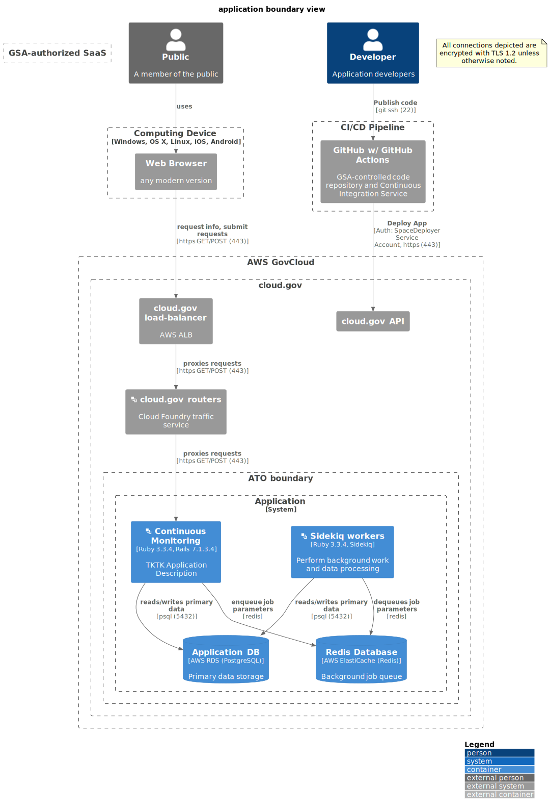

# Application boundary view



```plantuml
@startuml
!include https://raw.githubusercontent.com/plantuml-stdlib/C4-PlantUML/master/C4_Container.puml
' uncomment the following line and comment the first to use locally
' !include C4_Container.puml
LAYOUT_WITH_LEGEND()
title application boundary view

Person_Ext(public, "Public", "A member of the public")
Person(developer, "Developer", "Application developers")

Boundary(device, "Computing Device", "Windows, OS X, Linux, iOS, Android"){
    System_Ext(browser, "Web Browser", "any modern version")
}
Rel(public, browser, "uses", "")

note as EncryptionNote
All connections depicted are encrypted with TLS 1.2 unless otherwise noted.
end note
Boundary(aws, "AWS GovCloud") {
    Boundary(cloudgov, "cloud.gov") {
        System_Ext(cg_api, "cloud.gov API")
        System_Ext(aws_alb, "cloud.gov load-balancer", "AWS ALB")
        System_Ext(cloudgov_router, "<&layers> cloud.gov routers", "Cloud Foundry traffic service")
        Boundary(atob, "ATO boundary") {
            System_Boundary(inventory, "Application") {
                Container(app, "<&layers> Continuous Monitoring", "Ruby 3.3.4, Rails 7.1.3.4", "TKTK Application Description")
                ContainerDb(app_db, "Application DB", "AWS RDS (PostgreSQL)", "Primary data storage")
                Container(worker, "<&layers> Sidekiq workers", "Ruby 3.3.4, Sidekiq", "Perform background work and data processing")
                ContainerDb(redis, "Redis Database", "AWS ElastiCache (Redis)", "Background job queue")
            }
        }
    }
}

Boundary(gsa_saas, "GSA-authorized SaaS") {
}

Boundary(cicd, "CI/CD Pipeline") {
    System_Ext(githuball, "GitHub w/ GitHub Actions", "GSA-controlled code repository and Continuous Integration Service")
}

Rel(browser, aws_alb, "request info, submit requests", "https GET/POST (443)")
Rel(aws_alb, cloudgov_router, "proxies requests", "https GET/POST (443)")
Rel(cloudgov_router, app, "proxies requests", "https GET/POST (443)")
Rel(app, app_db, "reads/writes primary data", "psql (5432)")
Rel(app, redis, "enqueue job parameters", "redis")
Rel(worker, redis, "dequeues job parameters", "redis")
Rel(worker, app_db, "reads/writes primary data", "psql (5432)")
Rel(developer, githuball, "Publish code", "git ssh (22)")
Rel(githuball, cg_api, "Deploy App", "Auth: SpaceDeployer Service Account, https (443)")
@enduml
```

### Notes

* See the help docs for [C4 variant of PlantUML](https://github.com/RicardoNiepel/C4-PlantUML) for syntax help.
